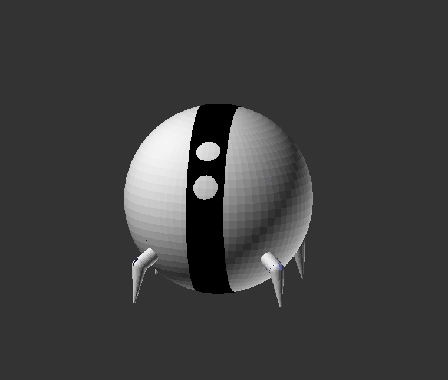

# Poseable One1 figurine

* Designed for 3D printing
* Ball (body) prints in two halves
* Eyes on the band
* Band connects the halves
* Legs to be attached via magnets for max poseability
* The "knees" of the legs articulate - to be assembled with a flexible wire
* Sized to be a desk toy - 100mm in diameter
